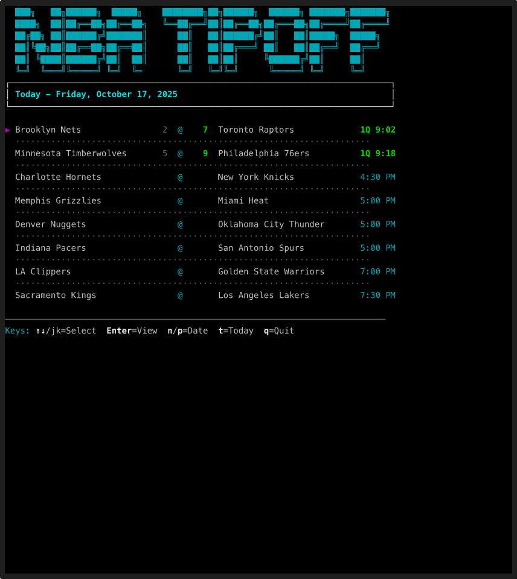

# Tipoff - NBA Terminal Viewer

Follow live NBA games directly in your terminal!



## Why?

A quick, discreet way to follow live NBA games or follow up on missed matchups from the night before

Inspired by [playball(https://github.com/paaatrick/playball/tree/main)]

## Quick Start

```bash
npx nba-tipoff
```

## Installation

```bash
npm install -g nba-tipoff
```

## Usage

```bash
# Launch with today's games
nba-tipoff

# Or use with npx (no installation required)
npx nba-tipoff
```

## Development

### Setup

```bash
# Clone the repository
git clone https://github.com/rfwilliams11/tipoff.git
cd tipoff

# Install dependencies
npm install

# Link the package locally for testing the CLI
npm link
```

### Running the Application

```bash
# Run in development mode
npm run dev

# Or use the CLI command (if linked)
nba-tipoff
```

### Testing

```bash
# Run tests
npm test

# Run tests with coverage
npm run test:coverage
```

### Project Structure

- `bin/tipoff` - CLI executable entry point
- `src/main.js` - Application bootstrap (auto-starts when run directly)
- `src/cli.js` - Command-line interface handler
- `src/components/` - React components for terminal UI
- `src/store/` - Redux store and slices (scoreboard, games)
- `src/services/` - API services and polling logic
- `src/utils/` - Utility functions and helpers

### Architecture Notes

- **Terminal UI**: Built with `react-blessed` for rendering React components in the terminal
- **State Management**: Redux Toolkit for managing application state
- **Live Updates**: Polling service for real-time game data from ESPN API
- **Entry Points**:
  - `npm run dev` executes `src/main.js` directly (auto-starts)
  - `nba-tipoff` command runs through `bin/tipoff` → `cli.js` → `main.start()`

## Features

- View today's NBA games in terminal
- Navigate between different dates
- View detailed game information with live updates
- Real-time statistics and play-by-play
- Keyboard navigation and shortcuts

## Keyboard Controls

### Scoreboard View

- `↑`/`↓` or `j`/`k` - Navigate between games
- `Enter` - View detailed game information
- `n` - Next day
- `p` - Previous day
- `t` - Go to today
- `q` or `Esc` - Quit

### Game Detail View

- `c` - Return to scoreboard
- `q` or `Esc` - Quit

## License

MIT
